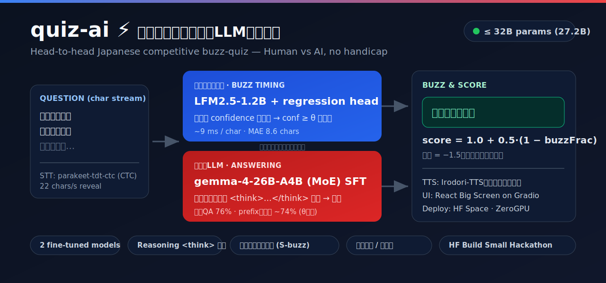
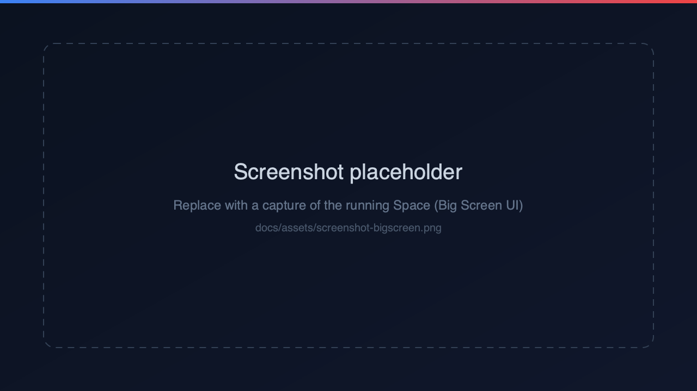

<p align="center">
  
</p>

<p align="center">
  <a href="README.md">English</a> · <b>日本語</b>
</p>

<p align="center">
  <a href="https://huggingface.co/spaces/build-small-hackathon/quiz-buzzer-ai"></a>
  <a href="https://huggingface.co/YUGOROU/quiz-main-gemma-merged"></a>
  <a href="https://huggingface.co/YUGOROU/quiz-buzz-reg-1.2bjp-merged"></a>
  
</p>

# quiz-ai ⚡ — 早押しクイズ特化型LLMシステム

競技**早押しクイズ**に特化した、**人間 vs AI をハンデなしの同条件**で対戦させるシステム。問題文を
1文字ずつ受信し、双方が「いつ押すか」を競う。導入部での早すぎる早押しは誤答リスクという、早押しの
本質的な駆け引きをそのままAIで再現する。**[HF Build Small Hackathon](https://huggingface.co/build-small-hackathon)**
向けに構築（合計パラメータ ≤ 32B）。

> 本プロジェクトは**日本語特化**。問題文は日本語で、2つのモデルは日本語のクイズ文法でSFT済み。

## デモ

<!-- docs/assets/screenshot-bigscreen.png を実機Spaceのスクショに差し替えてください。 -->
<p align="center">
  
</p>

▶️ **ライブデモ:** https://huggingface.co/spaces/build-small-hackathon/quiz-buzzer-ai

## 仕組み — 2つのファインチューン済みモデル（合計 ≤ 32B）

| 役割 | モデル | 機能 |
|---|---|---|
| 🔔 **割り込み（buzz）** | [`quiz-buzz-reg-1.2bjp-merged`](https://huggingface.co/YUGOROU/quiz-buzz-reg-1.2bjp-merged)（LFM2.5-1.2B + 回帰ヘッド） | 問題文を毎文字読み confidence を出力、`conf ≥ θ` で押す。約9 ms/char。 |
| 🧠 **メインLLM（回答）** | [`quiz-main-gemma-merged`](https://huggingface.co/YUGOROU/quiz-main-gemma-merged)（gemma-4-26B-A4B SFT） | buzz時点の部分問題文から `<think>…</think>` で推論し回答。 |

両モデルとも AI王 / JAQKET 由来のクイズ文法コーパスでSFT済（合計 ≈ 27.2B params）。

## アーキテクチャ

- **1 GPU窓 = 1マッチ。** ZeroGPU 上では `@spaces.GPU(duration=120)` の1回の呼び出しで、N問ぶんの
  buzz位置・推論・回答・正誤を**まとめて事前計算**する。フロントエンドはそれを滑らかに再生し、問題文を
  22文字/秒の擬似STTで開示しつつ、人間は**Space/タップ**でライブに早押しできる。
- **カスタムReactフロントエンド**（観客向け「Big Screen」1920×1080）を Gradio アプリが配信し、
  `POST /api/round` でマッチを取得。
- **スコア:** 正解 = `1.0 + 0.5·(1 − buzzFrac)`（早いほど高得点）／ 誤答 = `−1.5`。
- **投機的・非同期:** メインLLMは buzz 確定前から推論を開始し、`<think>` をストリームするので数秒で回答
  （人間が一拍考えるのと同じ感覚）。
- **TTS:** [Irodori-TTS](https://huggingface.co/Aratako/Irodori-TTS-500M-v3) が問題文を読み上げ、文字開示と同期。

## リポジトリ構成

```
quiz-ai/
├── docs/         設計ドキュメント（quiz-ai.md / corpus.md）とアセット
├── src/          コーパス前処理・Phase0 オーケストレータ・共通ユーティリティ
│   ├── qutils.py            正規化・採点(is_correct)・LLMクライアント・qid分割
│   ├── annotate.py          Step1: S-buzz アノテーション
│   ├── build_corpus{1,2}.py Step2/3: 割り込み用 / メイン用コーパス生成
│   ├── p0_orchestrator.py   Phase0: asyncio 投機推論オーケストレータ
│   └── buzz_client.py       conf ≥ θ の buzz 判定クライアント
├── train/        訓練・評価（Modal 上で実行）
│   ├── sft.py / modal_sft.py       メイン・buzz の SFT
│   ├── buzz_reg.py / buzz_rl.py    buzz 回帰ヘッド / 単独RL
│   ├── eval_knowledge.py           知識天井・全文/prefix 正解率
│   ├── eval_buzz.py                buzz 位置 MAE
│   └── e2e_modal.py                E2E（buzz → 投機推論 → 採点）
├── serve/        推論サーバ（buzz FastAPI / メイン vLLM）
├── bench/        速度ベンチ（LFM2.5 decode・問題文非含）
└── space/        HF Space（ZeroGPU + Gradio）ライブデモ
```

## モデル

| 用途 | リポジトリ |
|---|---|
| メイン（gemma-4-26B-A4B SFT） | [`YUGOROU/quiz-main-gemma-merged`](https://huggingface.co/YUGOROU/quiz-main-gemma-merged) |
| 割り込み（LFM2.5-1.2B + 回帰ヘッド） | [`YUGOROU/quiz-buzz-reg-1.2bjp-merged`](https://huggingface.co/YUGOROU/quiz-buzz-reg-1.2bjp-merged) |

## 実行

- **訓練・評価**は **Modal**: `uv run --with modal modal run train/…`。
- **ライブデモ**は `space/` の **HF Space（ZeroGPU）** — [`space/README.md`](space/README.md) 参照。
- スクリプトは全て `uv run` 前提（`python3` 直叩き不可）。

## データ・ライセンス

- 訓練データは **AI王 (Project AIO) / JAQKET** 由来。**問題文は再配布しない**: コーパス・デモ問題プール
  （`corpus/`・`annotated_questions.jsonl`・`questions_*.json` 等）は git 管理外。デモプールは
  `space/build_aio_pool.py`（AI王 `data/aio`・CC BY-SA 4.0 をDL）+ `src/label_genres.py` でローカル再生成する。
- 公開するのは**モデル重み＋訓練/推論コードのみ**（帰属表記つき）:
  > Quiz questions © abc/EQIDEN実行委員会 / 株式会社キュービック / クイズ法人カプリティオ. Non-commercial research use only. No dataset redistribution.
- `space/irodori_tts/` は [Aratako/Irodori-TTS-500M-v3](https://huggingface.co/Aratako/Irodori-TTS-500M-v3) を vendoring したもので、上流ライセンスに従う。
- メインモデルは [Gemma 利用規約](https://ai.google.dev/gemma/terms)、buzzモデルは [LFM Open License](https://huggingface.co/LiquidAI/LFM2.5-1.2B) を継承する。

## 謝辞

[AI王 / Project AIO](https://sites.google.com/view/project-aio/) · [JAQKET](https://www.nlp.ecei.tohoku.ac.jp/projects/jaqket/) · [Google Gemma](https://ai.google.dev/gemma) · [LiquidAI LFM2.5](https://huggingface.co/LiquidAI) · [Irodori-TTS](https://huggingface.co/Aratako/Irodori-TTS-500M-v3) · [Unsloth](https://github.com/unslothai/unsloth) · [HF Build Small Hackathon](https://huggingface.co/build-small-hackathon)
