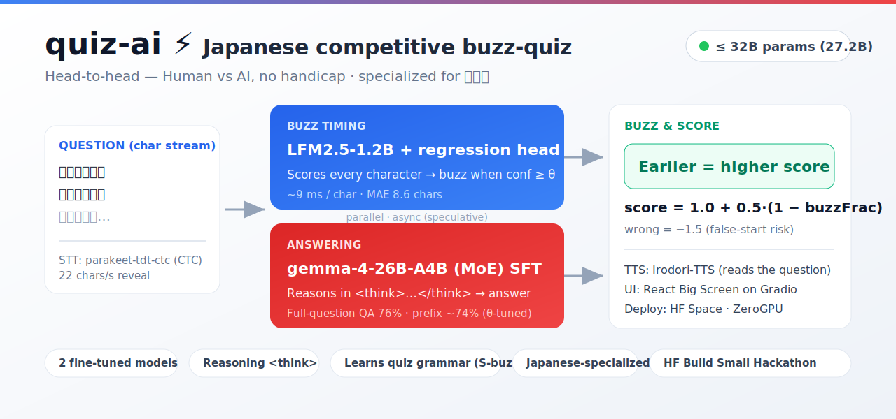
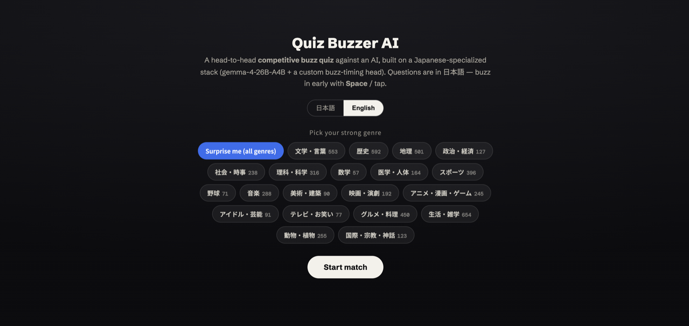
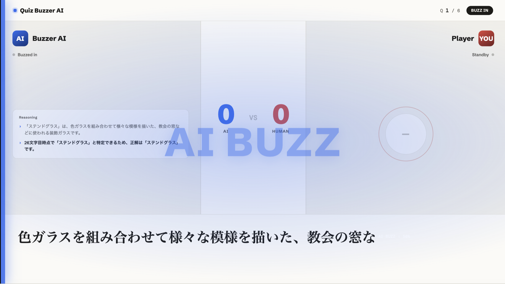

<p align="center">
  
</p>

<p align="center">
  <b>English</b> · <a href="README.ja.md">日本語</a>
</p>

<p align="center">
  <a href="https://huggingface.co/spaces/build-small-hackathon/quiz-buzzer-ai"></a>
  <a href="https://huggingface.co/YUGOROU/quiz-main-gemma-merged"></a>
  <a href="https://huggingface.co/YUGOROU/quiz-buzz-reg-1.2bjp-merged"></a>
  
  <a href="https://deepwiki.com/YUGOROU/quiz-ai"></a>
</p>

# quiz-ai ⚡ — a Japanese competitive buzz-quiz LLM system

A head-to-head **competitive buzz-quiz** (早押しクイズ) where a human plays against an AI under
**equal conditions — no handicap**. The question is revealed one character at a time and both sides race
to **buzz in as early as they dare**; buzzing too early on the lead-in is a costly false start. Built for
the **[HF Build Small Hackathon](https://huggingface.co/build-small-hackathon)** (total params ≤ 32B).

> 早押しクイズ (*hayaoshi quiz*) is a Japanese competitive-quiz format. This project is **specialized for
> Japanese** — questions are in 日本語, and the two models are fine-tuned on Japanese quiz grammar.

## Demo

<table>
<tr>
<td width="50%"></td>
<td width="50%"></td>
</tr>
<tr>
<td align="center"><sub>Pick a strong genre · bilingual EN/JA UI</sub></td>
<td align="center"><sub>The AI buzzes in (<b>AI BUZZ</b>) and shows live reasoning</sub></td>
</tr>
</table>

▶️ **Try it live:** https://huggingface.co/spaces/build-small-hackathon/quiz-buzzer-ai

## How it works — two fine-tuned models (≤ 32B total)

| Role | Model | Job |
|---|---|---|
| 🔔 **Buzz timing** | [`quiz-buzz-reg-1.2bjp-merged`](https://huggingface.co/YUGOROU/quiz-buzz-reg-1.2bjp-merged) (LFM2.5-1.2B + regression head) | Reads the question char-by-char, emits a confidence; buzzes when `conf ≥ θ`. ~9 ms/char. |
| 🧠 **Answering** | [`quiz-main-gemma-merged`](https://huggingface.co/YUGOROU/quiz-main-gemma-merged) (gemma-4-26B-A4B SFT) | From the partial question at buzz time, reasons in `<think>…</think>` and answers. |

Both are fine-tuned on a quiz-grammar corpus derived from AI王 / JAQKET (≈ 27.2B params total).

## Architecture

- **One GPU window = one match.** On ZeroGPU a single `@spaces.GPU(duration=120)` call **precomputes a
  whole match** — buzz position, reasoning, answer and correctness for N questions. The frontend then
  plays it back smoothly, streaming the question as mock-STT at 22 chars/s while the human can buzz in
  live (**Space** / tap).
- **Custom React frontend** (the spectator "Big Screen", 1920×1080) is served by a Gradio app and fetches
  the live match from `POST /api/round`.
- **Scoring:** correct = `1.0 + 0.5·(1 − buzzFrac)` (earlier buzz → bigger reward); wrong = `−1.5`.
- **Speculative & async:** the answering model starts reasoning before the buzz is committed; `<think>`
  reasoning is streamed so the AI answers in a few seconds — like a human pausing to think.
- **TTS:** [Irodori-TTS](https://huggingface.co/Aratako/Irodori-TTS-500M-v3) reads the question aloud,
  synced to the character reveal.

## Repository layout

```
quiz-ai/
├── docs/         Design docs (quiz-ai.md / corpus.md) and assets
├── src/          Corpus preprocessing, Phase-0 orchestrator, shared utilities
│   ├── qutils.py            normalization · scoring (is_correct) · LLM client · qid split
│   ├── annotate.py          Step 1: S-buzz annotation
│   ├── build_corpus{1,2}.py Step 2/3: buzz-model / answering-model corpora
│   ├── p0_orchestrator.py   Phase 0: asyncio speculative-inference orchestrator
│   └── buzz_client.py       conf ≥ θ buzz decision client
├── train/        Training & evaluation (run on Modal)
│   ├── sft.py / modal_sft.py       SFT for the answering & buzz models
│   ├── buzz_reg.py / buzz_rl.py    buzz regression head / single-model RL
│   ├── eval_knowledge.py           knowledge-ceiling & full/prefix accuracy
│   ├── eval_buzz.py                buzz-position MAE
│   └── e2e_modal.py                end-to-end (buzz → speculative answer → scoring)
├── serve/        Inference serving (buzz FastAPI / main vLLM)
├── bench/        Latency benchmarks (LFM2.5 decode; no question text)
└── space/        HF Space (ZeroGPU + Gradio) live demo
```

## Models

| Use | Repo |
|---|---|
| Answering (gemma-4-26B-A4B SFT) | [`YUGOROU/quiz-main-gemma-merged`](https://huggingface.co/YUGOROU/quiz-main-gemma-merged) |
| Buzz timing (LFM2.5-1.2B + regression head) | [`YUGOROU/quiz-buzz-reg-1.2bjp-merged`](https://huggingface.co/YUGOROU/quiz-buzz-reg-1.2bjp-merged) |

## Running

- **Training / evaluation** runs on **Modal**: `uv run --with modal modal run train/…`.
- **Live demo** is the **HF Space (ZeroGPU)** under `space/` — see [`space/README.md`](space/README.md).
- All scripts assume `uv run` (do not call `python3` directly).

## Data & license

- Training data is derived from **AI王 (Project AIO) / JAQKET**. The **quiz questions are not
  redistributed**: the corpus and demo question pool (`corpus/`, `annotated_questions.jsonl`,
  `questions_*.json`, …) are git-ignored. Regenerate the demo pool locally with
  `space/build_aio_pool.py` (downloads AI王 `data/aio`, CC BY-SA 4.0) + `src/label_genres.py`.
- Only **model weights + training/inference code** are published, with attribution:
  > Quiz questions © abc/EQIDEN実行委員会 / 株式会社キュービック / クイズ法人カプリティオ. Non-commercial research use only. No dataset redistribution.
- `space/irodori_tts/` is vendored from [Aratako/Irodori-TTS-500M-v3](https://huggingface.co/Aratako/Irodori-TTS-500M-v3) and retains its upstream license.
- The answering model is a fine-tune of Google **Gemma 4**, which is released under the [Apache License 2.0](https://ai.google.dev/gemma/apache_2.md.txt); the buzz model inherits the [LFM Open License](https://huggingface.co/LiquidAI/LFM2.5-1.2B).

## Acknowledgements

[AI王 / Project AIO](https://sites.google.com/view/project-aio/) · [JAQKET](https://www.nlp.ecei.tohoku.ac.jp/projects/jaqket/) · [Google Gemma](https://ai.google.dev/gemma) · [LiquidAI LFM2.5](https://huggingface.co/LiquidAI) · [Irodori-TTS](https://huggingface.co/Aratako/Irodori-TTS-500M-v3) · [Unsloth](https://github.com/unslothai/unsloth) · the [HF Build Small Hackathon](https://huggingface.co/build-small-hackathon).
